# System Tracking Feature Sequence Flows

Cap nhat: 2026-07-08  
Muc tieu: tai lieu sequence flow cho cac chuc nang dang co trong System Tracking. Tai lieu nay bam theo source hien tai: Next.js dashboard/route handlers xu ly console va worker, Supabase Postgres la runtime database, Supabase Vault giu secret, Supabase Edge Functions chu yeu nhan request mobile hoac verify IAP.

## Muc luc

| Muc | Flow |
|---|---|
| 1 | Tong quan runtime |
| 2 | Dang nhap va RBAC |
| 3 | User, role va app assignment |
| 4 | Store mapping va credential config |
| 5 | Xem secret bang OTP |
| 6 | Mobile register FCM token |
| 7 | Mobile notification event |
| 8 | Notification overview/detail |
| 9 | Send notification theo queue |
| 10 | Scheduled notification |
| 11 | Pause/resume notification job |
| 12 | IAP Android verify |
| 13 | IAP iOS verify |
| 14 | Apple App Store Server Notification webhook |
| 15 | IAP 2-hour GA4 event |
| 16 | Review fetch manual/scheduled |
| 17 | Reply review |
| 18 | Background jobs widget |
| 19 | BigQuery platform target |

## 1. Tong quan runtime

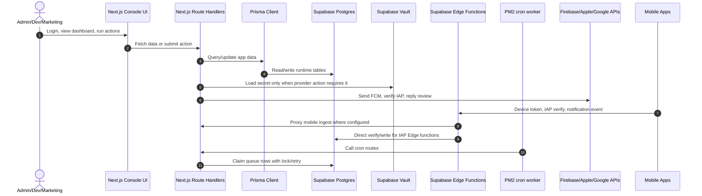

Rule runtime hien tai:

| Thanh phan | Vai tro |
|---|---|
| Next.js route handlers | Xu ly console API, queue worker endpoint, notification send, review fetch, IAP admin API |
| Supabase Postgres | Source of truth cho mapping, token, notification, IAP, review, background jobs |
| Supabase Vault | Giu plaintext credential; app table chi luu metadata va `vault_secret_id` |
| Supabase Edge Functions | Nhan request mobile, verify IAP mobile, webhook Apple, proxy mot so endpoint ve Next server |
| PM2 `npm start` | Chay Next server va cac loop cron trong `scripts/review-fetch-cron.ts` |
| Provider APIs | FCM, Google Play Developer API, App Store Server API, App Store Connect API, GA4 Measurement Protocol |

## 2. Dang nhap va RBAC

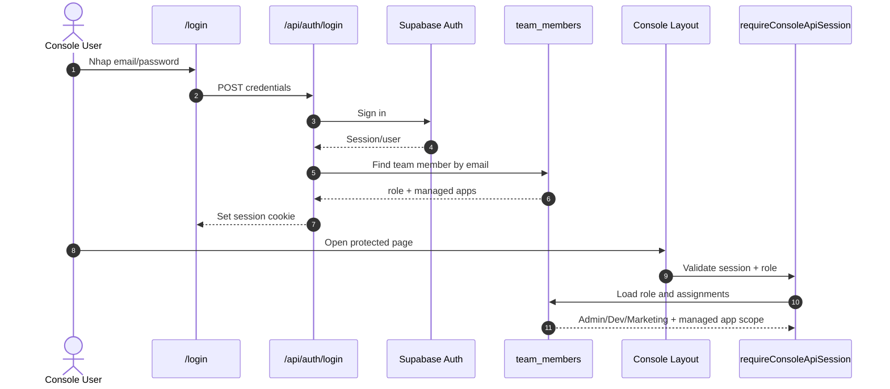

Role rule:

| Role | Quyen chinh |
|---|---|
| Admin | Xem config, app mapping, user management, send notification, assign app |
| Dev | Xem va van hanh cac module duoc phep, tuy route |
| Marketing | Xem overview/history/schedules/review theo app duoc assign, khong send notification |

## 3. User, role va app assignment

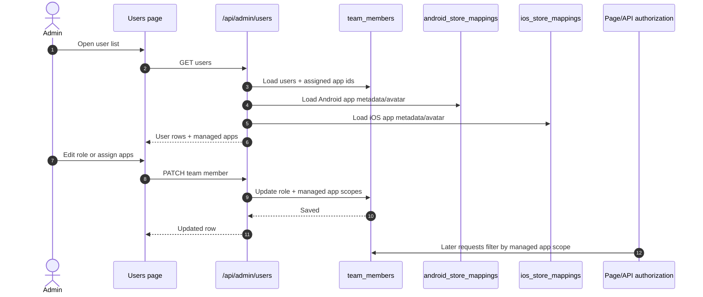

## 4. Store mapping va credential config

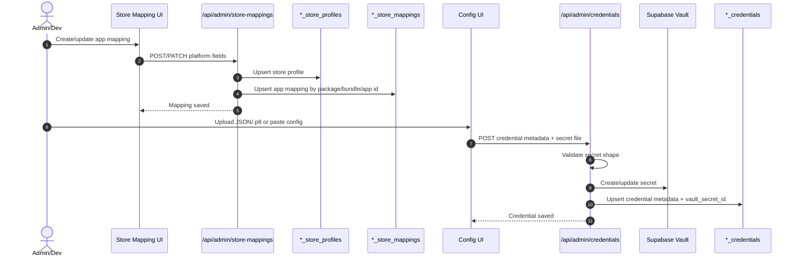

Plain secret khong duoc luu vao app tables. Cac table credential chi giu `credential_ref`, metadata va `vault_secret_id`.

## 5. Xem secret bang OTP

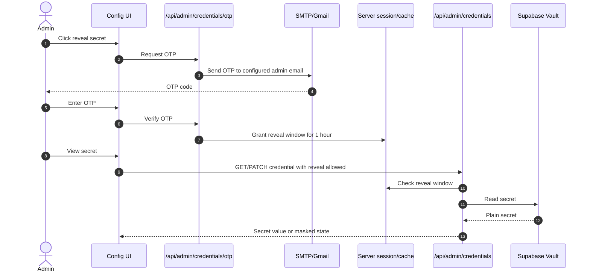

## 6. Mobile register FCM token

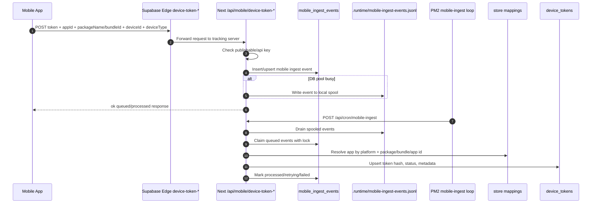

Quan trong:

| Diem | Y nghia |
|---|---|
| `app_id`, `product_app_id` | Duoc normalize de tranh lech `LA-019`, `la019`, `la-019` |
| `device_id + platform + app` | Dung de replace token moi cho cung device/app |
| Duplicate recent event | Bi dedupe trong cooldown de giam ghi DB |
| Spool file | Bao ve DB khi pool dang nghen |

## 7. Mobile notification event

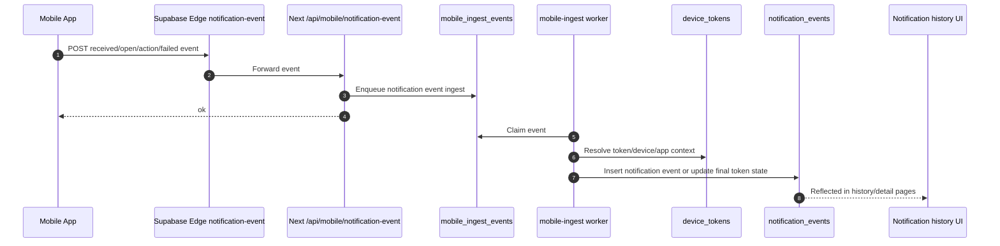

Mot FCM token chi nen co mot final state trong mot send job: `sent`, `opened`, hoac `failed`. Khi app open, history doi trang thai token do thay vi tao duplicate row cho cung token.

## 8. Notification overview/detail

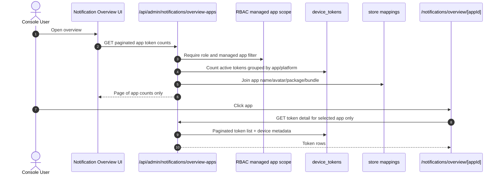

Design rule: overview chi load so lieu tong hop. List token chi load khi user mo detail app de tranh query qua nang.

## 9. Send notification theo queue

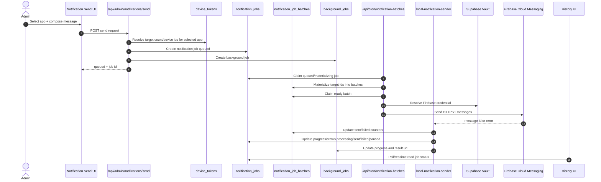

Hien tai `supabase/functions/send-notification` va `dispatch-notifications` khong xu ly gui nua. Gui notification chay tren Next server/PM2 worker de giam tai Edge Function va de kiem soat DB pool tot hon.

## 10. Scheduled notification

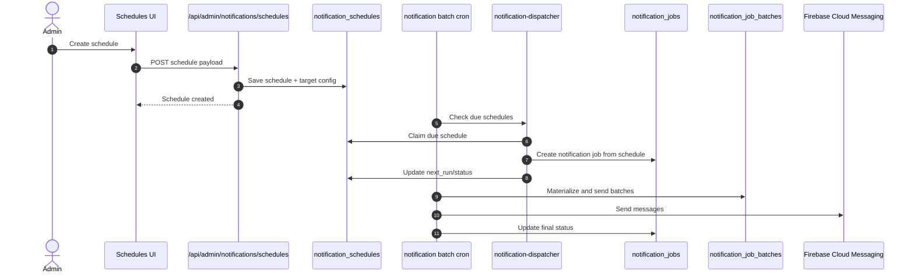

## 11. Pause/resume notification job

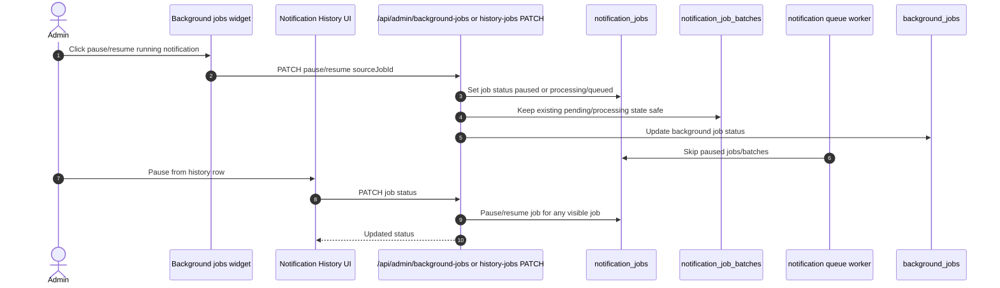

Pause chi ngan worker claim tiep batch moi. Batch dang gui co the hoan tat roi moi dung han.

## 12. IAP Android verify

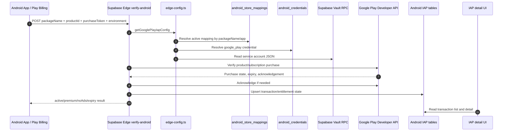

## 13. IAP iOS verify

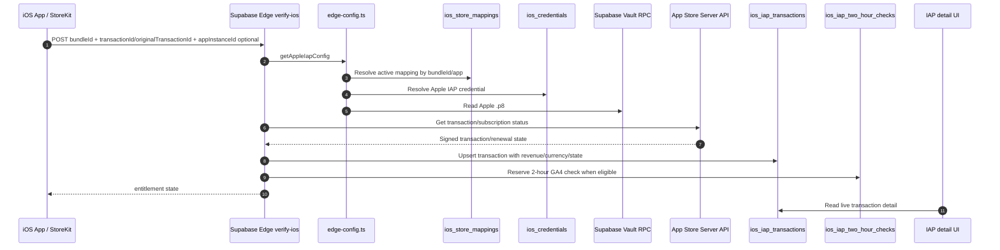

`appInstanceId` nen gui len tu mobile de backend co the ban Measurement Protocol ve dung Firebase app instance. Flow cu van optional de khong lam hong app chua update.

## 14. Apple App Store Server Notification webhook

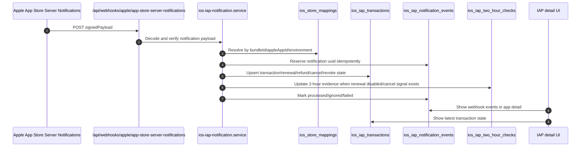

Event Apple can cap nhat state:

| Notification | Y nghia trong app |
|---|---|
| `DID_CHANGE_RENEWAL_STATUS` | Cap nhat renew enabled/disabled |
| `DID_RENEW`, `DID_RECOVER`, `INTERACTIVE_RENEWAL` | Gia han hoac recover subscription |
| `DID_FAIL_TO_RENEW` | Billing issue/grace/retry |
| `CANCEL`, `REFUND`, `REVOKE` | Thu hoi/refund/cancel entitlement neu du evidence |

## 15. IAP 2-hour GA4 Event

Chi tiết đầy đủ của flow này nằm trong [ios-iap-two-hour-ga4-flow.md](./ios-iap-two-hour-ga4-flow.md).

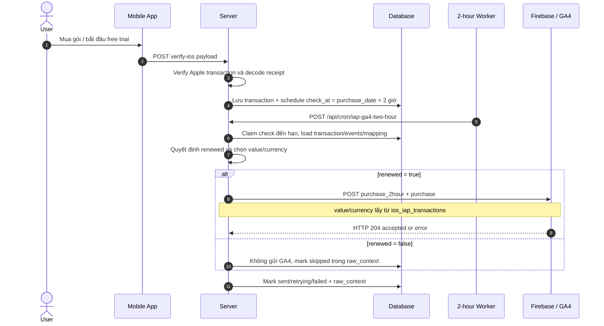

Revenue rule:

| Decision | Events | `value` gửi lên GA4 | `currency` |
|---|---|---|---|
| User không hủy sau 2 giờ | `purchase_2hour`, `purchase` | Revenue từ `revenue_micros`, fallback `price_milliunits` | Currency của transaction |
| User hủy/disable renew trong 2 giờ | Không gửi GA4, mark skipped | n/a | n/a |
| Thiếu giá nhưng vẫn `renewed=true` | Gửi `0` | `0` | Currency nếu có hoặc `USD` fallback |

## 16. Review fetch manual/scheduled

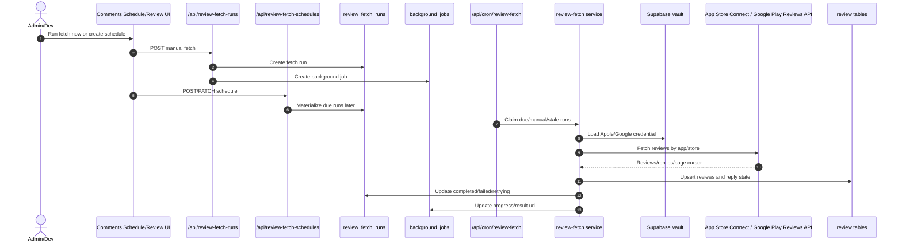

## 17. Reply review

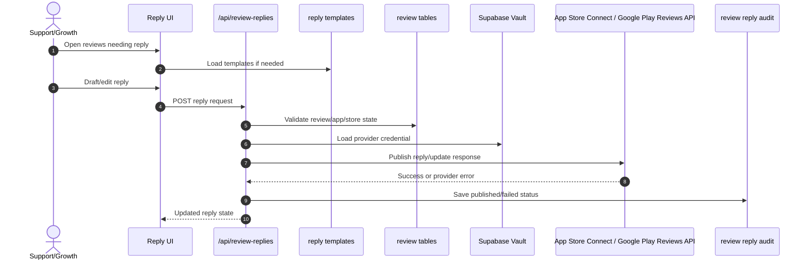

Rule hien tai: reply can di qua UI/API va co audit status. Khong de provider credential lo ra client.

## 18. Background jobs widget

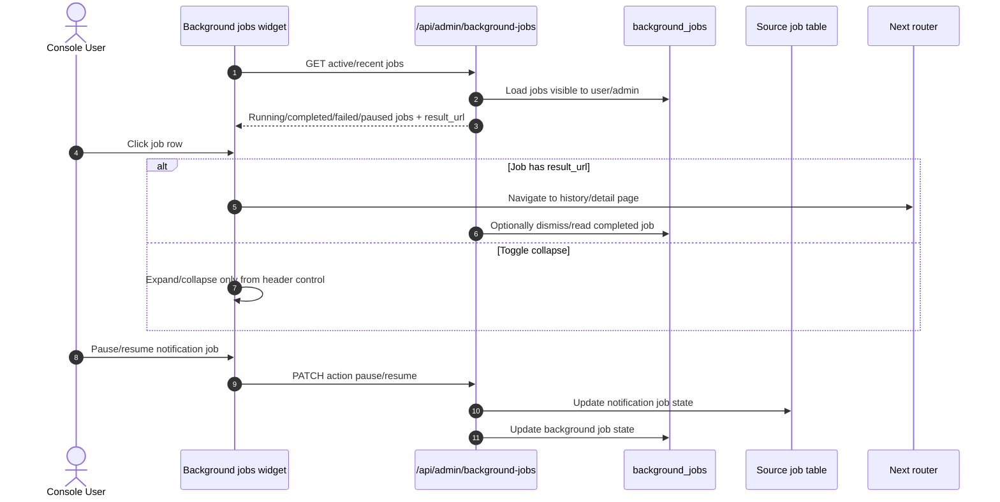

Job result url mapping:

| Job type | Result page |
|---|---|
| `NOTIFICATION_SEND` | `/notifications/history/[jobId]` |
| Review fetch | Review/comment detail or schedule page |
| IAP 2-hour check | IAP app detail when applicable |

## 19. BigQuery platform target

BigQuery chua phai runtime source of truth trong source hien tai. Neu trien khai theo tai lieu platform mau, flow nen la mirror/ops layer, khong thay the Supabase lock queue.

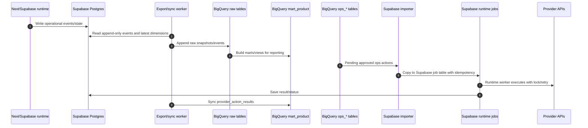

Nguyen tac khi them BigQuery:

| Rule | Ly do |
|---|---|
| BigQuery khong luu raw secret | Secret that nam trong Supabase Vault |
| BigQuery khong giu runtime lock | Postgres/queue can transaction, lock, retry |
| Ops action tu BigQuery phai import vao Supabase job | Tranh BigQuery thanh job runner |
| Dashboard co the doc BigQuery mart | Giam load truc tiep len Postgres production |
