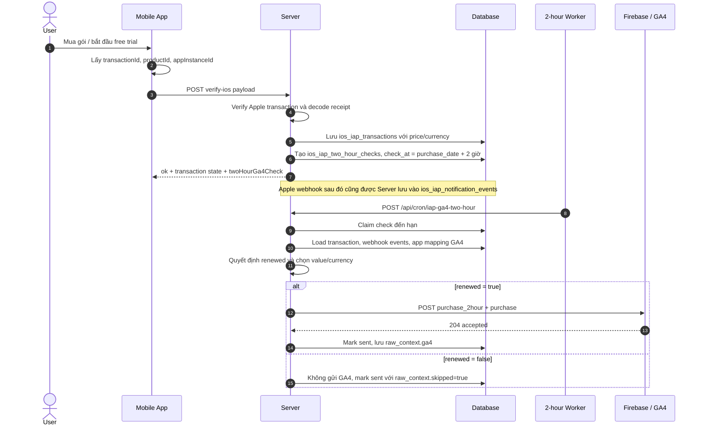

# Flow iOS IAP 2 Giờ Gửi GA4

Tài liệu này mô tả flow hiện tại của iOS IAP: mobile gửi gì lên server, server lưu gì, sau 2 giờ server kiểm tra renew/cancel như thế nào, payload nào được gửi lên Firebase/GA4, và cần kiểm tra gì trên Firebase để xác nhận event đã đúng.

## Mục Tiêu

- Mobile verify giao dịch IAP với server.
- Server lưu transaction vào `ios_iap_transactions`.
- Server tạo một check trong `ios_iap_two_hour_checks` tại mốc `purchase_date + 2 giờ`.
- Sau 2 giờ, server kiểm tra user còn khả năng renew hay đã có tín hiệu hủy/disable/refund/revoke.
- Chỉ khi kết quả là `renewed = true`, server mới gửi GA4:
  - `purchase_2hour`: custom event dùng để tạo audience/prediction cho nhóm user còn giữ gói sau 2 giờ.
  - `purchase`: event chuẩn GA4 để ghi nhận purchase/revenue theo `value`, `currency`, `items`.

## Sequence Tổng Quan



## Mobile Gửi Lên Gì

Endpoint hiện tại:

```text
POST /functions/v1/verify-ios
```

Payload tối thiểu:

```json
{
  "bundleId": "com.test.app.new.app",
  "transactionId": "2000001202055679"
}
```

Payload nên gửi để flow 2-hour GA4 chạy đầy đủ:

```json
{
  "bundleId": "com.test.app.new.app",
  "transactionId": "2000001202055679",
  "productId": "com.test.new.yearly",
  "environment": "production",
  "appInstanceId": "9b60a2658ecb44fc9973450c62bf8b92",
  "firebaseAppId": "1:166580653809:ios:f923e136c83682d2f92350",
  "userId": "optional-app-user-id"
}
```

| Field | Bắt buộc | Ý nghĩa |
|---|---:|---|
| `bundleId` | Có | Bundle ID để map app/store credential |
| `transactionId` | Có | Apple transaction id cần verify |
| `productId` | Nên có | Product/subscription id, dùng fallback khi Apple payload thiếu |
| `environment` | Nên có | Mặc định `production`, đổi sang `sandbox` khi test sandbox/StoreKit |
| `appInstanceId` | Cần cho GA4 2-hour | Firebase Analytics app instance id; thiếu field này thì không schedule được GA4 2-hour |
| `firebaseAppId` | Không bắt buộc | Firebase app id của app; nếu thiếu server resolve từ app mapping/global config |
| `userId` | Không bắt buộc | App user/account id để đối chiếu sau này |

Mobile không cần gửi giá gói nếu transaction trong `ios_iap_transactions` đã có `revenue_micros`, `price_milliunits`, và `currency`.

## Server Lưu Gì Khi Verify

`verify-ios` verify transaction qua Apple, decode `signedTransactionInfo`, rồi upsert vào `ios_iap_transactions`.

Các field quan trọng:

| Table | Field | Ý nghĩa |
|---|---|---|
| `ios_iap_transactions` | `transaction_id` | Transaction id đã verify |
| `ios_iap_transactions` | `original_transaction_id` | Subscription chain id |
| `ios_iap_transactions` | `product_id` | Product id |
| `ios_iap_transactions` | `environment` | `production` hoặc `sandbox` |
| `ios_iap_transactions` | `revenue_micros` | Giá trị revenue dạng micros; `289000000000` = `289000` VND |
| `ios_iap_transactions` | `price_milliunits` | Giá dạng milliunits; fallback nếu `revenue_micros` null |
| `ios_iap_transactions` | `currency` | Currency ISO, ví dụ `VND`, `USD` |
| `ios_iap_transactions` | `is_trial` | Có phải free trial/offer trial hay không |
| `ios_iap_two_hour_checks` | `app_instance_id` | Dùng để Measurement Protocol gửi đúng Firebase app instance |
| `ios_iap_two_hour_checks` | `check_at` | Thời điểm worker được phép check, mặc định purchase + 2 giờ |
| `ios_iap_two_hour_checks` | `ga4_event_name` | Mặc định `purchase_2hour` |

## Điều Kiện Gửi GA4 Sau 2 Giờ

Server chỉ gửi event lên Firebase/GA4 khi `decision.renewed = true`.

`renewed = true` khi:

- Webhook/transaction cho thấy renewal vẫn enabled.
- Hoặc sau 2 giờ không có tín hiệu hủy/disable/refund/revoke nào. Khi đó server dùng evidence:

```text
default:no_cancel_signal_after_two_hours
```

và renewal status:

```text
enabled_or_no_cancel_signal
```

`renewed = false` khi server thấy một trong các tín hiệu sau:

| Nguồn | Tín hiệu | Kết quả |
|---|---|---|
| Apple notification event | `DID_CHANGE_RENEWAL_STATUS` + `AUTO_RENEW_DISABLED` | Không gửi GA4 |
| Apple notification event | `CANCEL` | Không gửi GA4 |
| Apple notification event | `EXPIRED` | Không gửi GA4 |
| Apple notification event | `REFUND` | Không gửi GA4 |
| Apple notification event | `REVOKE` | Không gửi GA4 |
| Transaction state | `canceled`, `expired`, `refunded`, `revoked` | Không gửi GA4 |

Khi `renewed = false`, worker không gửi request tới GA4. Check vẫn được mark `sent` để không retry vô hạn, nhưng `raw_context.skipped = true`.

## Server Chọn Revenue Như Thế Nào

Sau 2 giờ, server load transaction theo `transaction_id` và `original_transaction_id`, rồi chọn revenue theo thứ tự:

1. Ưu tiên transaction đúng `transaction_id` và có revenue `> 0`.
2. Nếu transaction đó bằng `0`/null, tìm transaction cùng `original_transaction_id` có revenue `> 0`.
3. Nếu vẫn không có, fallback transaction liên quan có revenue field.
4. Cuối cùng mới fallback row `0`/null.

Giá trị gửi GA4:

```text
value = revenue_micros / 1_000_000
fallback value = price_milliunits / 1_000
currency = ios_iap_transactions.currency
```

Ví dụ:

```text
revenue_micros = 289000000000
currency = VND
```

GA4 sẽ nhận:

```json
{
  "value": 289000,
  "currency": "VND"
}
```

Nếu user cancel/disable renew trước mốc 2 giờ thì không gửi `purchase_2hour` và cũng không gửi `purchase`, nên sẽ không có revenue mới từ flow này.

## Payload Gửi Lên Firebase/GA4

Khi `renewed = true`, server gửi Measurement Protocol tới:

```text
https://www.google-analytics.com/mp/collect?firebase_app_id=...&api_secret=...
```

Payload mẫu:

```json
{
  "app_instance_id": "9b60a2658ecb44fc9973450c62bf8b92",
  "events": [
    {
      "name": "purchase_2hour",
      "params": {
        "bundle_id": "com.test.app.new.app",
        "engagement_time_msec": 1,
        "environment": "production",
        "original_transaction_id": "2000001202055312",
        "product_id": "com.test.new.yearly",
        "renewal_status": "enabled_or_no_cancel_signal",
        "transaction_id": "2000001202055679",
        "currency": "VND",
        "revenue_source": "revenue_micros",
        "revenue_transaction_id": "2000001202055679",
        "value": 289000
      }
    },
    {
      "name": "purchase",
      "params": {
        "transaction_id": "iap_2hour_2000001202055679",
        "currency": "VND",
        "value": 289000,
        "items": [
          {
            "item_id": "com.test.new.yearly",
            "item_name": "com.test.new.yearly",
            "price": 289000,
            "quantity": 1
          }
        ]
      }
    }
  ]
}
```

Ghi chú:

- `purchase_2hour` là custom event để build audience/prediction.
- `purchase` là event chuẩn GA4, chỉ giữ các param cần thiết cho purchase/revenue: `transaction_id`, `currency`, `value`, `items`.
- `transaction_id` của event `purchase` có prefix `iap_2hour_` để tránh trùng transaction gốc của app.
- `purchase` không gửi các param nội bộ như `environment`, `bundle_id`, `debug_mode`, `renewal_status`.
- Nếu `IOS_IAP_2HOUR_GA4_SEND_PURCHASE_EVENT=false`, server chỉ gửi `purchase_2hour`.
- Nếu `IOS_IAP_2HOUR_GA4_DEBUG_MODE=true`, server thêm `debug_mode: 1` vào custom event `purchase_2hour` để dễ xem trong DebugView. Event `purchase` vẫn giữ sạch theo chuẩn GA4.

## Cách Kiểm Tra Trên Firebase/GA4

### 1. Kiểm tra server response hoặc log trước

Kết quả đúng từ endpoint force send/test hoặc cron sẽ có:

```json
{
  "eventNames": ["purchase_2hour", "purchase"],
  "purchaseRevenueEventNames": ["purchase"],
  "responseStatus": 204,
  "validationOnly": false
}
```

Ý nghĩa:

- `responseStatus = 204`: GA4 Measurement Protocol đã accept request.
- `eventNames` có đủ `purchase_2hour` và `purchase`: server đã gửi cả custom signal và purchase chuẩn.
- `purchaseRevenueEventNames` có `purchase`: event revenue chuẩn đang bật.
- `validationOnly = false`: request gửi thật, không chỉ validate.

### 2. Kiểm tra DebugView

Nếu bật `IOS_IAP_2HOUR_GA4_DEBUG_MODE=true`, vào Firebase Console hoặc GA4 DebugView và kiểm tra:

| Event | Kỳ vọng |
|---|---|
| `purchase_2hour` | Hiện gần realtime trong DebugView |
| `purchase_2hour.params.value` | `289000` với ví dụ VND ở trên |
| `purchase_2hour.params.currency` | `VND` |
| `purchase_2hour.params.product_id` | `com.test.new.yearly` |
| `purchase_2hour.params.renewal_status` | `enabled`, hoặc `enabled_or_no_cancel_signal` |
| `purchase_2hour.params.revenue_source` | `revenue_micros` hoặc `price_milliunits` |

Lưu ý: event `purchase` được giữ sạch, không gắn `debug_mode`. Vì vậy nếu muốn xác nhận `purchase` ngay lập tức, ưu tiên kiểm tra server log/raw_context. Trên GA4 report chuẩn, `purchase` có thể cần thời gian xử lý mới hiện.

### 3. Kiểm tra GA4 Events report

Trong GA4/Firebase Events report, cần kiểm tra:

| Event name | Kỳ vọng |
|---|---|
| `purchase_2hour` | Event count tăng khi check sau 2 giờ đủ điều kiện renew |
| `purchase` | Event count tăng khi server gửi purchase chuẩn |

Với event `purchase`, các giá trị kỳ vọng:

| Field | Giá trị mẫu |
|---|---|
| `transaction_id` | `iap_2hour_2000001202055679` |
| `value` | `289000` |
| `currency` | `VND` |
| `items[0].item_id` | `com.test.new.yearly` |
| `items[0].item_name` | `com.test.new.yearly` |
| `items[0].price` | `289000` |
| `items[0].quantity` | `1` |

Trong cột revenue của GA4:

- `purchase_2hour` là custom event nên không chắc được tính vào Total revenue.
- `purchase` là event chuẩn nên là event chính dùng để ghi nhận purchase/revenue.
- GA4 có thể cần thời gian để cập nhật revenue trong report.
- Nếu property có currency khác currency gửi lên, GA4 có thể hiển thị số tiền sau khi quy đổi theo cấu hình/report của GA4.

### 4. Kiểm tra đúng Firebase app

Cần đối chiếu:

| Nơi kiểm tra | Cần khớp |
|---|---|
| Server log `firebaseAppId` | Firebase App ID trong app mapping |
| Payload `app_instance_id` | App instance id lấy từ Firebase Analytics SDK trên đúng app/device |
| GA4 property | Property đang gắn với Firebase app đó |
| `api_secret` | Measurement Protocol API secret của đúng data stream |

Nếu `firebaseAppId` hoặc `api_secret` sai app, GA4 vẫn có thể trả `204` nhưng event không xuất hiện ở property bạn đang xem.

### 5. Kiểm tra database

Kiểm tra transaction có giá:

```sql
select
  transaction_id,
  original_transaction_id,
  product_id,
  environment,
  state,
  is_trial,
  revenue_micros,
  price_milliunits,
  currency,
  purchase_date,
  expires_date
from ios_iap_transactions
where transaction_id = '2000001202055679'
   or original_transaction_id = '2000001202055312'
order by purchase_date desc nulls last;
```

Check nhanh giá sẽ gửi:

```sql
select
  transaction_id,
  currency,
  revenue_micros::numeric / 1000000.0 as revenue_value,
  price_milliunits::numeric / 1000.0 as price_value
from ios_iap_transactions
where transaction_id = '2000001202055679';
```

Kiểm tra 2-hour check:

```sql
select
  id,
  transaction_id,
  original_transaction_id,
  product_id,
  environment,
  check_at,
  status,
  renewed,
  renewal_status,
  ga4_sent_at,
  attempts,
  last_error,
  raw_context
from ios_iap_two_hour_checks
where transaction_id = '2000001202055679';
```

Kỳ vọng khi đã gửi thành công:

- `status = sent`
- `renewed = true`
- `ga4_sent_at` có giá trị
- `raw_context.ga4.eventNames` có `purchase_2hour` và `purchase`
- `raw_context.ga4.purchaseRevenueEventNames` có `purchase`
- `raw_context.ga4.responseStatus = 204`

Kỳ vọng khi user đã cancel/disable/refund/revoke:

- `status = sent`
- `renewed = false`
- `raw_context.skipped = true`
- `raw_context.ga4 = null`
- Không có event mới trên Firebase/GA4 từ flow 2-hour này

## Env Liên Quan

| Env | Ý nghĩa |
|---|---|
| `IOS_IAP_2HOUR_ENABLED` | Bật/tắt worker loop |
| `IOS_IAP_2HOUR_INTERVAL_MS` | Tần suất worker gọi cron |
| `IOS_IAP_2HOUR_CHECK_DELAY_MS` | Delay sau purchase, mặc định 2 giờ |
| `IOS_IAP_2HOUR_CHECK_LIMIT` | Số check claim mỗi batch |
| `IOS_IAP_2HOUR_CHECK_MAX_ATTEMPTS` | Số lần retry tối đa |
| `IOS_IAP_2HOUR_CHECK_SECRET` | Secret cho cron route, fallback `NOTIFICATION_QUEUE_SECRET` |
| `IOS_IAP_2HOUR_GA4_DEBUG_MODE` | Thêm `debug_mode: 1` vào custom event `purchase_2hour` |
| `IOS_IAP_2HOUR_GA4_VALIDATE_ONLY` | Dùng endpoint validate/debug của GA4 |
| `IOS_IAP_2HOUR_GA4_SEND_PURCHASE_EVENT` | Bật/tắt event chuẩn `purchase`; mặc định true |
| `IOS_IAP_2HOUR_GA4_EVENT_NAME` | Tên custom event, mặc định `purchase_2hour` |

## Kết Luận Nhanh

Flow chuẩn hiện tại:

1. Mobile gửi `bundleId`, `transactionId`, `productId`, `environment`, `appInstanceId`, `firebaseAppId`.
2. Server verify với Apple và lưu transaction.
3. Server tạo pending check sau 2 giờ.
4. Worker sau 2 giờ lấy evidence + giá từ `ios_iap_transactions`.
5. Nếu còn renew hoặc không có cancel signal, server gửi `purchase_2hour` và `purchase`.
6. Nếu đã cancel/disable/refund/revoke, server không gửi GA4 và mark `raw_context.skipped=true`.
7. Kiểm tra thành công bằng `responseStatus = 204`, `raw_context.ga4.eventNames`, DB check status, server log, DebugView cho `purchase_2hour`, và GA4 report cho `purchase`.
