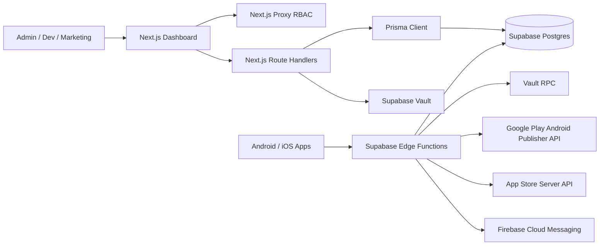
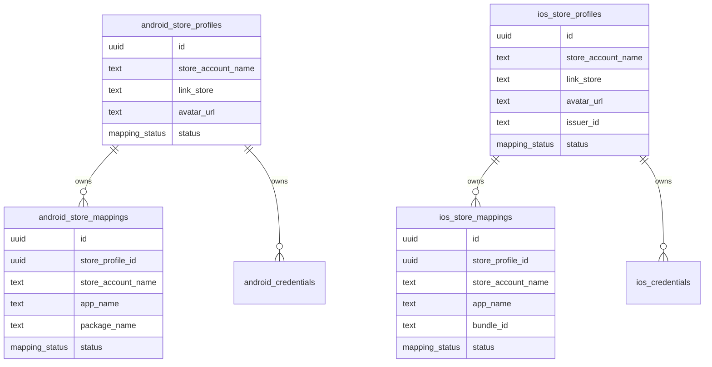
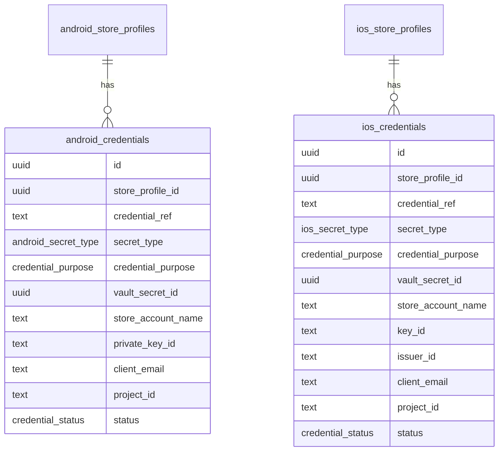
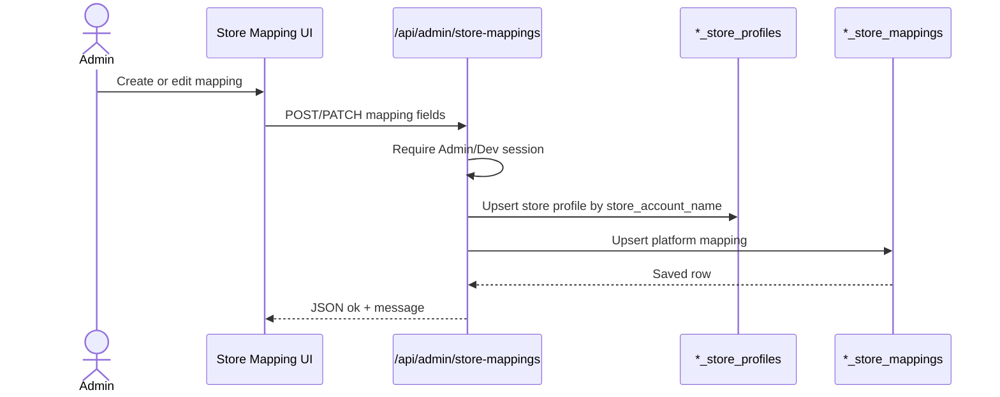
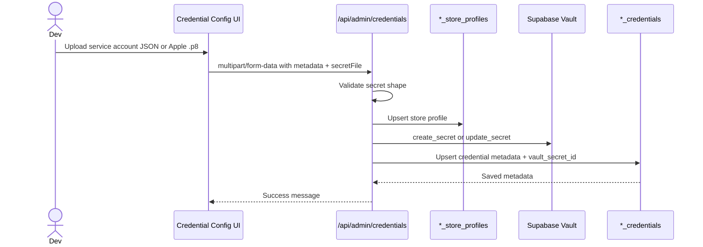
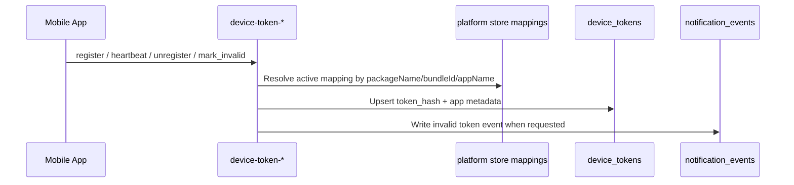
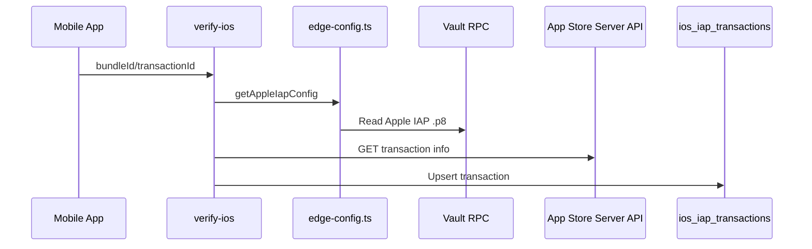

# Mobile Tracking System Architecture

Tai lieu nay mo ta thiet ke hien tai cua System Tracking: Next.js dashboard, Supabase Postgres, Supabase Vault, va Supabase Edge Functions cho notification token + IAP verification.

## Runtime Overview



## Core Modules

| Module | Route / Function | Database source | Role |
| --- | --- | --- | --- |
| Login/RBAC | `/login`, `/api/auth/*` | `team_members` + Supabase Auth | Admin, Dev, Marketing |
| Users | `/users`, `/api/admin/users` | `team_members` | Admin |
| Android App Mapping | `/store-mapping/android` | `android_store_profiles`, `android_store_mappings` | Admin, Dev |
| iOS App Mapping | `/store-mapping/ios` | `ios_store_profiles`, `ios_store_mappings` | Admin, Dev |
| Android Credential Config | `/configs/android` | `android_credentials` + Vault | Admin, Dev |
| iOS Credential Config | `/configs/ios` | `ios_credentials` + Vault | Admin, Dev |
| Device Token API | `device-token-android`, `device-token-ios` | `device_tokens`, store mappings | Supabase JWT caller |
| Android IAP Verification | `verify-android` | `android_credentials` + Vault + `iap_transactions` | Supabase JWT caller |
| iOS IAP Verification | `verify-ios` | `ios_credentials` + Vault + `ios_iap_transactions` | Supabase JWT caller |

Do not use legacy tables in new runtime code:

- `integration_configs`
- `store_credential_secrets`
- `encrypted_secret_payload`

## Current Store Mapping Model

Mappings are split by platform and linked to store profiles.



## Credential And Vault Model

Credential rows keep metadata only. Plaintext secret is stored in Supabase Vault.



Credential purpose mapping:

| Use case | Platform | `credential_purpose` | Secret type |
| --- | --- | --- | --- |
| Firebase notification | Android/iOS | `firebase_admin` | `firebase_service_account` |
| Google Play IAP | Android | `google_play` | `google_play_service_account` |
| Apple IAP | iOS | `iap` | `apple_iap_p8` |
| App Store review/API | iOS | `review` | `apple_asc_p8` |

Vault read path for Edge Functions:

```text
public.system_tracking_get_vault_secret(secret_id uuid)
```

This RPC must be executable by `service_role` only. Do not grant it to `anon` or `authenticated`.

## Store Mapping CRUD



## Credential Upload



Plaintext secret must never be stored in app tables.

## Edge Config Common

All Edge Functions should use:

```text
system-tracking-server/supabase-legacy/functions/_shared/edge-config.ts
```

Main helpers:

- `createAdminClient()`
- `resolveMobileAppConfig()`
- `getFirebaseAdminConfig()`
- `getGooglePlayIapConfig()`
- `getAppleIapConfig()`

Detailed usage is documented in [edge-functions-config-guide.md](edge-functions-config-guide.md).

## Device Token API

Device token registration is split by platform:

- `device-token-android`: accepts Android FCM token with `packageName` or app name.
- `device-token-ios`: accepts iOS FCM token with `bundleId` or app name.



## IAP Verification



## Per-User Supabase Setup

This repo is intended to be pushed as reusable source code. Each user must create and configure their own Supabase project.

Per user setup:

1. Create a new Supabase project.
2. Enable Supabase Vault.
3. Copy `.env.example` to `.env`.
4. Fill their own `NEXT_PUBLIC_SUPABASE_URL`, publishable key, `DATABASE_URL`, and `DIRECT_URL`.
5. Run Prisma migrations.
6. Create the first Supabase Auth user matching seeded `admin@limgrow.com`, or update the seed/migration for their own admin email before first deploy.
7. Deploy Edge Functions to their own project ref.

Do not commit real project refs, DB passwords, publishable keys, service-role keys, or `.env` files.
